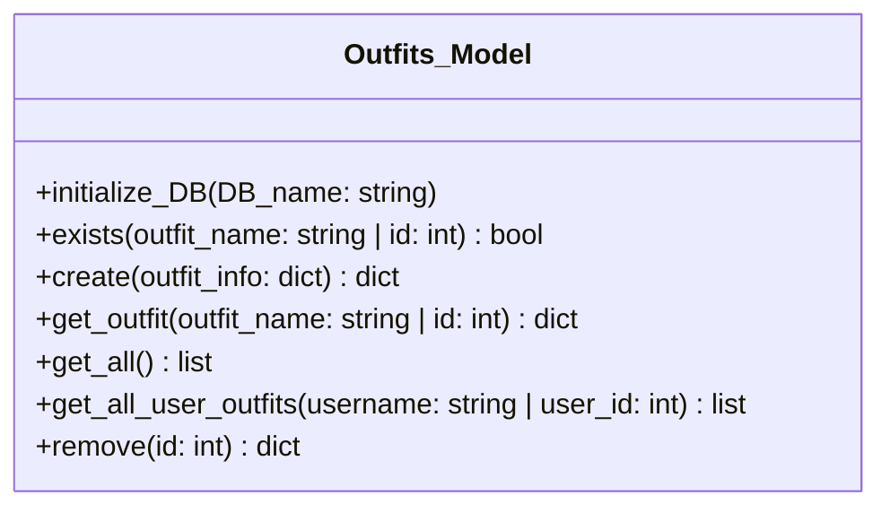

## Closets Entity

The Closets entity represents each user's unique closet, storing a JSON list of clothes IDs and linking to the user.

### Folder structure
DigitalCloset/
├── models/
│ └── Closets_Model.py
├── tests/
│ ├── sample_closet_data.py
│ └── test_closets_model.py


"""
# Outfits Model

## Project Overview
Digital Closet lets users create outfits from clothes and organize them socially.

## Folder Structure

```
DigitalCloset/
├── closetappDB.db
├── models/
│   └── Outfits_Model.py
├── tests/
│   ├── sample_outfits_data.py
│   └── test_outfits_model.py
└── README.md
```

## Outfits Class Model


## Running Unit Tests
```bash
cd DigitalCloset
pytest tests/test_outfits_model.py
```
"""
